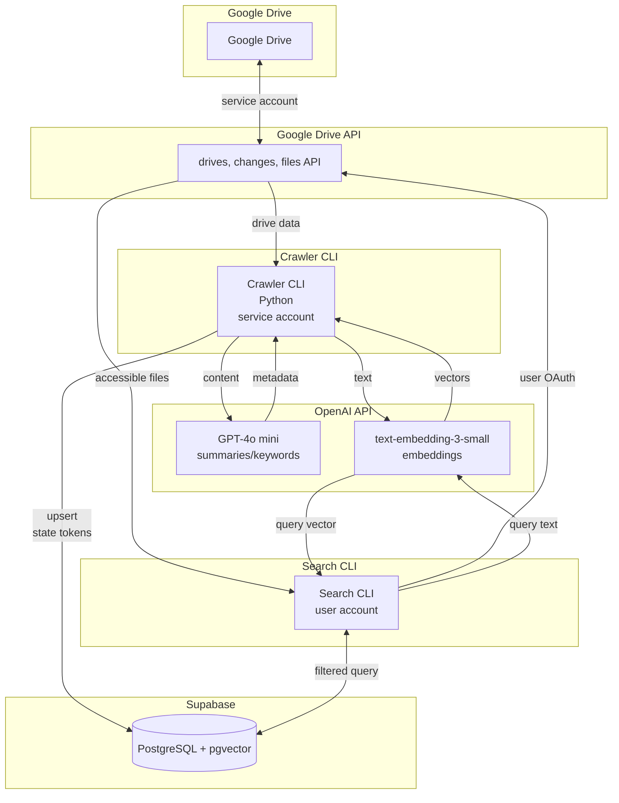

# 生成AIとベクトル検索を活用したGoogle Drive検索システム 設計書

## 0. ドキュメント情報
- **目的**: docs/Requirements.md の要件を満たすMVP（Step 1）の実装方針を整理し、開発・運用チームの共通理解を醸成する。
- **対象**: 開発エンジニア、SRE、セキュリティ担当、PoC利用部門。
- **参照**: 要件（FR-C/S、NFR、KPI）、Concept.md、CLI仕様案。

---

## 1. システム概要
`.env` の `GOOGLE_DRIVE_TARGET_FOLDER_ID` で指定された共有ドライブ配下フォルダ内のテキスト資産を Google Drive API でクロールし、GPT-4o mini で要約とキーワード、text-embedding-3-small でベクトルを生成して Supabase (PostgreSQL + pgvector) に格納する。ユーザーは検索CLIから自然言語クエリを発行し、**必ずユーザー自身のDrive権限かつターゲットフォルダ内に絞り込んだファイル集合**に対してベクトル近傍検索を行うことで関連度の高い結果を得る。全体はCLIのみで提供し、PoCのKPI（権限厳守・検索有用性・インデックス鮮度）を満たすことを目的とする。

---

## 2. ゴール / 非ゴール
- **ゴール**
  - FR-C-01〜06 に従い、`.env` で指定した単一フォルダ配下に限定したクロールと差分同期。
  - FR-S-01〜04 に従うセマンティック検索CLI提供。
  - KPI-1〜3 を満たす運用能力と観測性を確保。
- **非ゴール**
  - 将来拡張とされるハイブリッド検索、LLMリランキング、対話UI（要件2.2）。
  - 個人マイドライブ／OCRなど対象外ファイル種別のサポート。
  - Web UI や常時稼働サーバの提供（CLIベース運用のみ）。

---

## 3. 全体アーキテクチャ

2本の非同期フローで構成される。
1. **インデックスフロー**: サービスアカウントで `GOOGLE_DRIVE_TARGET_FOLDER_ID` 配下のみをクロールし、AIメタデータとベクトルを生成して `file_index` にUpsert、`crawler_state` を更新。
2. **検索フロー**: 各ユーザーのOAuth資格情報でターゲットフォルダ内の閲覧可能な `file_id` を取得し、ベクトル近傍検索を実行して結果を表示。

---

## 4. コンポーネント設計

### 4.1 Google Drive クローラー CLI
- **実行形態**: `gdrive-indexer crawl --mode={delta,full}`。cronやワークフローエンジンから15分間隔でdeltaモードを起動しKPI-3を満たす。
- **主要モジュール**
  1. **ターゲットフォルダ検証 (FR-C-01)**: `.env` の `GOOGLE_DRIVE_TARGET_FOLDER_ID` を読み込み、`files.get` で存在確認と `driveId`・フォルダ名を取得。`crawler_state.drive_id` には当該フォルダが属する共有ドライブIDを保存し、Start Page Token を1レコードで管理する。
  2. **差分ポーリング**: ターゲットフォルダの `drive_id` を元に `changes.getStartPageToken` と `changes.list` を逐次呼び出し、`parents`/`changeType` で `GOOGLE_DRIVE_TARGET_FOLDER_ID` 配下のみを作成/更新/削除イベントとしてバッチ化。APIレート制限に合わせて`maxResults`/遅延を調整。
  3. **コンテンツ抽出 (FR-C-02)**: ファイル種類ごとに Google Drive API (`files.export`, `files.get` + `alt=media`) を呼び分けテキスト化する。抽出不可の場合はリトライ後にスキップしログへ WARNING を出力。
  4. **AIメタデータ生成 (FR-C-03)**: GPT-4o mini へテンプレートプロンプトを渡し、200-300字の要約と5-10個のキーワードをJSON形式で取得。レスポンス検証を行い、フォールバックとして再試行最大3回 (NFR-REL-01)。
  5. **ベクトル化 (FR-C-04)**: `file_name + summary + keywords.join(",")` を `text-embedding-3-small` で1536次元ベクトルに変換。
  6. **インデックス同期 (FR-C-05)**: SupabaseのHTTP APIまたは直結のPostgreSQLクライアントを使い、Upsert(ON CONFLICT file_id) と削除処理を実行。削除対象は `changes.list` の `removed=true` を検出。
  7. **状態保存 (FR-C-06)**: 各ドライブ処理完了後に `crawler_state` に新しい `start_page_token` と `last_run_at` を保存。成功コミット後にのみトークン更新して再実行時の漏れを防止。
- **エラー制御**
  - Google API/OpenAI APIは指数バックオフ（1s, 2s, 4s）で最大3回リトライ（NFR-REL-01）。
  - 単一ファイルの失敗はスキップして集計し、最後に失敗件数をログ出力。
  - APIコスト監視のため、呼び出し回数・トークン数を集約してINFOログ (NFR-COST-01)。

### 4.2 Supabase / PostgreSQL
- `file_index` と `crawler_state` の2テーブルを使用（要件8章）。
- `file_index.embedding` に `pgvector` インデックス（HNSW推奨）を作成。`file_id` 主キーでUpsert可能。
- 監査のため `updated_at`, `last_modifier` をクローラーから埋める。
- Supabase Row Level Security はPoC段階では無効。

### 4.3 セマンティック検索 CLI
- **実行形態**: `gdrive-search query "<自然言語>" --topk=5 --distance-threshold=0.5`。
- **処理手順**
  1. **認証 (FR-S-02)**: OAuth2クライアントでユーザーにブラウザ認可を促し、トークンを端末ローカル安全領域に保存。以降の実行ではリフレッシュトークンを利用。
  2. **権限フィルタリング**: Google Drive API の `files.list` (`corpora=user`, `includeItemsFromAllDrives=true`, `supportsAllDrives=true`, `q="'${GOOGLE_DRIVE_TARGET_FOLDER_ID}' in parents"`) でユーザーが閲覧可能かつターゲットフォルダ配下の `file_id` のみを取得。ページングしつつIDリストを最大数千件まで収集し、バッチでSupabaseクエリに渡す。PoCではリストをPostgreSQLの `= ANY(:visible_ids)` へバインド。
  3. **クエリベクトル化 (FR-S-03)**: `text-embedding-3-small` でクエリをベクトル化。
  4. **ベクトル検索**: `SELECT ... FROM file_index WHERE file_id = ANY(:visible_ids) ORDER BY embedding <-> :query_vector ASC LIMIT :topk`。任意で `distance < threshold` 条件を追加。
  5. **結果整形 (FR-S-04)**: `file_name`, `summary`, `https://drive.google.com/file/d/<file_id>/view`, `distance` を表形式で標準出力。結果ゼロ件時は「該当データなし」を表示。
  6. **ロギング**: クエリ長、取得件数、距離統計をINFOログに残し、エラー時はスタックトレースを含めてERROR出力。

### 4.4 設定 / シークレット管理
- `GOOGLE_APPLICATION_CREDENTIALS`: サービスアカウントJSON（クローラー用）。
- `GOOGLE_OAUTH_CLIENT_ID/SECRET`: ユーザー検索用OAuthクライアント。
- `GOOGLE_DRIVE_TARGET_FOLDER_ID`: クロール/検索対象とする共有ドライブ配下フォルダのID。
- `SUPABASE_URL`, `SUPABASE_SERVICE_ROLE_KEY` または `DATABASE_URL`: DB接続。
- `OPENAI_API_KEY`: GPT-4o miniとtext-embedding-3-small共通キー。
- すべて環境変数または秘密管理サービスから読み込み、設定ファイルには平文保存しない（NFR-SEC-02）。

---

## 5. データフロー詳細

### 5.1 インデックス更新フロー
1. クローラー起動時に `mode` 判定。`full` の場合 `changes.list` ではなく `files.list (q="'${folder_id}' in parents")` で当該フォルダの全件を取得。
2. `.env` から `GOOGLE_DRIVE_TARGET_FOLDER_ID` を読み込み `files.get` で `driveId` を解決し、`crawler_state` に保存している Start Page Token を取得。
3. `changes.list(..., pageToken)` で差分を読み、イベントを `created/updated/deleted` に分類。
4. 対象ファイルをダウンロードしテキスト抽出（Google Docs: `export?mimeType=text/plain`, PDF: `export?mimeType=text/plain` or Drive export to plain text)。
5. GPT-4o mini へプロンプト送信: `{title, plain_text}` を入力し JSON で `summary`, `keywords` を受領。
6. キーワード文字列を結合し embedding API 呼び出し。
7. SupabaseへUpsert（`file_id`, `file_name`, `summary`, `keywords`, `embedding`, `updated_at`, `last_modifier`）。削除イベントは `DELETE FROM file_index WHERE file_id IN (...)`。
8. ターゲットフォルダに対応する `crawler_state.start_page_token` と `last_run_at` を更新。
9. 実行結果（処理件数、失敗件数、APIコスト）をログ化。

### 5.2 検索フロー
1. CLI起動時にクエリ入力をバリデーション（3〜500文字）。
2. ユーザーのOAuthトークンを確立し、`files.list (q="'${GOOGLE_DRIVE_TARGET_FOLDER_ID}' in parents")` でターゲットフォルダ内の閲覧可能 `file_id` を収集。
3. クエリをembedding化しSupabaseにRPCまたはSQLを送信。
4. pgvector距離でソートし `topk` 件＋閾値条件に合致するデータを取得。
5. 結果リストを整形出力。distance, summary, Driveリンクを表示。必要に応じて JSON/表形式切り替えオプションを用意。

---

## 6. 外部インターフェース
- **Google Drive API**
  - `files.get`: `GOOGLE_DRIVE_TARGET_FOLDER_ID` の存在確認と `driveId` 取得。
  - `changes.getStartPageToken` / `changes.list`: 差分検出。
  - `files.list`: フォルダ内全件取得およびユーザー権限でのファイル列挙。
  - `files.export`: Google Workspace系ドキュメントのプレーンテキスト抽出。
- **OpenAI API**
  - `gpt-4o-mini`（ChatCompletions）: 要約・キーワード生成。
  - `text-embedding-3-small`: ファイルテキストと検索クエリのベクトル化。
- **Supabase/PosgreSQL**
  - REST/RPCまたは直接接続でUpsert/検索。
  - `pgvector` 拡張で `<->` 演算子を使用。

---

## 7. セキュリティ / 権限設計
- **権限分離**: クローラーは管理者サービスアカウント（ドライブ横断権限）、検索CLIはユーザー本人のOAuthスコープ (`https://www.googleapis.com/auth/drive.readonly`) のみを使用。
- **資格情報管理 (NFR-SEC-02)**: すべてのキーは環境変数/秘密管理で渡し、リポジトリに含めない。OAuthトークンはOSの秘密ストア（macOS Keychain, Linux Secret Service）に保存し、権限のないユーザーには読めないようにする。
- **監査ログ**: クローラーは処理した `file_id` のハッシュ一覧、検索CLIは実行ユーザーとクエリ長など、機微でないメタ情報のみロギング。実際のクエリ文はデバッグ時以外出力しない。

---

## 8. 可観測性・運用
- **ログ**: 構造化JSONログで `timestamp`, `component`, `level`, `message`, `target_folder_id`, `drive_id`, `processed_count`, `api_call_counts`, `latency_ms` などを出力。CLI標準出力にINFO、標準エラーにWARN/ERROR。
- **メトリクス**: 最低限として処理時間、OpenAIトークン数、Drive APIコール数、ベクトルインデックスサイズを集計し、PoCではログから集計。将来的にはPrometheus exporterを検討。
- **アラート**: 連続失敗や権限フィルタ未適用といった重大イベントは exit code ≠ 0 としてCI/CDやジョブスケジューラで検知。
- **スケジューリング**: `cron`/GitHub Actionsなどで15分毎δクロール＋1日1回fullクロール。ジョブ実行サマリをSlack/メールに通知。

---

## 9. テスト計画との対応
- **差分同期テスト (FR-C-01/05)**: テスト用に用意したターゲットフォルダで作成/更新/削除を行い、クローラー実行後のDBとDrive差分を比較する統合テストを用意。
- **検索有用性 (KPI-2)**: 代表20クエリを事前定義し、人手評価フォームを準備。検索CLIの出力をCSV化して評価容易にする。
- **可用性/リトライ (NFR-REL-01)**: OpenAI/Drive APIのモックで 429/5xx を返却し、指数バックオフが所定回数で止まることをユニットテスト。
- **コスト監視 (NFR-COST-01)**: API呼び出しカウンターモジュールに対する単体テストと、ログフォーマット検証。

---

## 10. リスクとオープン課題
- **APIクォータ**: フォルダ限定であっても `files.list` / `changes.list` が高頻度になる可能性。Drive側の `changes.watch` 等のWebhook検討や、フォルダごとの実行間隔調整が必要。
- **要約品質**: GPT-4o miniで200-300字の要約を安定生成できない場合がある。プロンプト最適化やトークン制御、失敗時のフォールバックロジックの改善が課題。
- **権限リストのスケール**: 可視ファイルが数万件を超えると `ANY(:visible_ids)` が非効率。中長期的には `file_acl` 的な補助テーブルやRLSでの権限制御を検討。
- **PoC後のUI**: 現状CLIのみでユーザー体験が限定的。Step 2/3でのWeb UI・会話型UI拡張に備え、API層の抽象化を早期に進める必要がある。

---

## 11. 付録
- **CLI I/O**: CLIはUTF-8の標準入出力。設定ファイル(`~/.config/gdrive-indexer/config.toml`)でSupabase接続やOpenAIモデル名を上書き可能にする。
- **フォルダ構成案**
  ```
  /app
    /crawler
      drive_client.py
      text_extractor.py
      metadata_generator.py
      indexer.py
    /search
      auth.py
      visible_file_service.py
      query_runner.py
    /db
      repositories.py
      migrations/
  ```
- **今後の拡張ポイント**: `embedding` 再計算ジョブ、ハイブリッド検索API、RAG用途への流用など。
