# Document Locator - アーキテクチャ図

このドキュメントでは、クローラーおよび検索処理のフローを Mermaid 記法で可視化しています。

---

## 1. システム全体構成

---

## 2. クローラー処理フロー

### 2.1 クローラー全体フロー

### 2.2 クロールモード解決フロー

### 2.3 AI パイプライン詳細

### 2.4 Drive ファイル列挙 (Paging)

---

## 3. 検索処理フロー

### 3.1 検索全体フロー

### 3.2 ベクトル検索ラウンド詳細

### 3.3 ヒット数バケット分類

### 3.4 LLM リランク処理

---

## 4. データフロー図

### 4.1 クローラーのデータフロー

### 4.2 検索のデータフロー

---

## 5. シーケンス図

### 5.1 クローラー実行シーケンス

### 5.2 検索実行シーケンス

```mermaid
sequenceDiagram
    participant CLI as CLI
    participant Search as Search
    participant OpenAI as OpenAI
    participant Supabase as Supabase
    participant User as User (optional)

    CLI->>Search: runSearchWithRanking(request)

    loop 検索ループ (max N回)
        Search->>OpenAI: extractKeywords(query)
        OpenAI-->>Search: keywords[]

        Search->>OpenAI: generateEmbedding(queryText)
        OpenAI-->>Search: embedding[]

        Search->>Supabase: match_drive_file_index(embedding, filters)
        Supabase-->>Search: rows[]

        Search->>Search: classifyHitCount(filtered.length)

        alt bucket = tooMany
            Search->>User: askUser(refinement question)
            User-->>Search: additional keywords
            Search->>Search: update query
        else bucket = few
            Search->>OpenAI: rerankResultsWithLLM(candidates)
            OpenAI-->>Search: ranked file_ids[]
        else bucket = single | mid | none
            Search->>Search: finalize results
        end
    end

    Search->>CLI: SearchOutcome
```

---

## 6. 状態遷移図

### 6.1 検索バケット状態遷移

### 6.2 クロールモード状態遷移

---

## 7. コンポーネント依存関係

